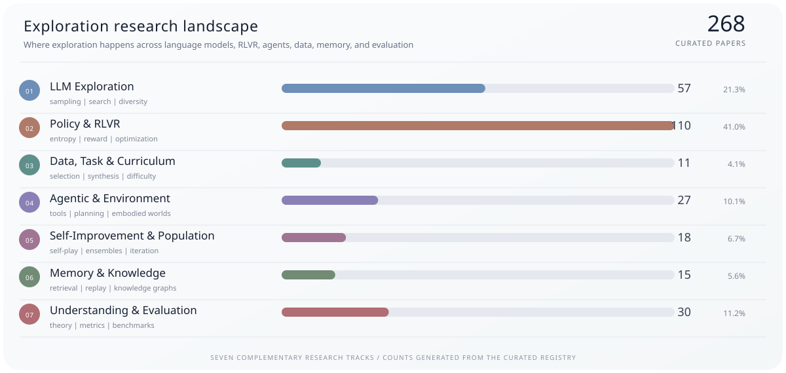

# Awesome Exploration

**A curated research map of exploration in large language models and agents.**

   

[Guide](#guide) · [Research map](#research-map) · [10-paper introduction](#start-here) · [Catalog](#catalog) · [Detailed metadata](README_DETAILED.md) · [Contribute](CONTRIBUTING.md)

## Guide

| Start here | What you will find |
|---|---|
| **[What counts as exploration](#what-counts-as-exploration)** | Sutton & Barto frame exploration as trying alternatives to improve future action selection, while exploitation uses current knowledge to obtain reward. |
| **[Research map](#research-map)** | Five categories spanning LLM generation, RLVR and policy learning, agentic inference, agentic training, and evidence. |
| **[Taxonomy lens](#taxonomy-lens)** | How phase, level, signal, mechanism, problem, and setting describe each paper. |
| **[10 papers to get started](#start-here)** | A manually selected introduction to LLM exploration; automatic ranking is intentionally avoided. |
| **[Full catalog](#catalog)** | All curated papers, grouped by their primary research category. |

## What counts as exploration?

> This repository treats exploration as a **primary research variable**: a paper must identify where exploration happens and introduce or analyze a concrete exploration signal or mechanism. Generic RL, agents, test-time scaling, self-improvement, and diversity work are excluded when exploration is merely incidental.

> Evidence snapshot: **2026-07-23** · [Taxonomy design](docs/TAXONOMY.md) · [2026 curation notes](docs/CURATION_2026.md)

## Research map

Every paper has one home in the map; its tags then describe the research lens. Start with the category that matches your question, then use the tags to compare mechanisms across categories.

| Category | Best for |
|---|---|
| **[Exploration for LLM Generation & Inference](#category-1)** | Sampling, decoding, reasoning-path search, and output diversity without a learning update. |
| **[Exploration for RLVR, Policy & Curriculum](#category-2)** | Curricula, RL/RLVR updates, replay, rewards, and language-model policy-distribution control. |
| **[Agentic Exploration](#category-3)** | Test-time exploration across the web, tools, GUIs, knowledge graphs, and embodied environments. |
| **[Agentic Exploration for Training](#category-4)** | Agent experience collection, interactive task synthesis, self-play training, and agent policy optimization. |
| **[Understanding, Evaluation & Benchmarks](#category-5)** | Surveys, theory, metrics, benchmarks, and evidence about exploration. |

<strong>How to read the tags</strong>

The former Token / Sequence / Policy sections are now `level` tags. Entropy, temperature, and noise belong to a broad distributional-and-stochastic family, but remain separate tags because they play different causal roles.

| Tag dimension | Values |
|---|---|
| **Phase** | data generation; supervised post-training; RL training; inference; test-time adaptation; continual/self-improvement |
| **Level** | token; response/sequence; trajectory/action; latent/representation; policy distribution; data/task; population |
| **Signal** | entropy/probability; uncertainty/confidence; novelty/curiosity; semantic diversity; coverage; information gain; reward/advantage; disagreement |
| **Mechanism** | sampling/decoding; temperature control; noise/perturbation; regularization; gradient reshaping; intrinsic reward; structured/tree search; replay/memory; curriculum; self-play; ensemble/population |
| **Problem** | entropy or mode collapse; sparse reward; local optimum; capability boundary; long horizon; exploration/exploitation; recovery |
| **Setting** | math; code; multimodal; creative/open-ended; web; tool use; knowledge graph; embodied; multi-agent |

## Catalog at a glance

| Collection | Papers |
|---|---:|
| Exploration for LLM Generation & Inference | 62 |
| Exploration for RLVR, Policy & Curriculum | 125 |
| Agentic Exploration | 22 |
| Agentic Exploration for Training | 20 |
| Understanding, Evaluation & Benchmarks | 30 |
| **Curated total** | **259** |

2026 peer-reviewed acceptances in the catalog:

| Venue | Papers |
|---|---:|
| ACL 2026 Findings | 35 |
| ACL 2026 Main | 26 |
| ICLR 2026 | 58 |
| ICML 2026 | 63 |
| **Accepted total** | **182** |

## 10 Papers to Get Started with LLM Exploration

- **[From Trial-and-Error to Improvement: A Systematic Analysis of LLM Exploration Mechanisms in RLVR](https://arxiv.org/abs/2508.07534)** — arXiv `2508.07534` · Understanding, Evaluation & Benchmarks ·   
- **[Representation-Based Exploration for Language Models: From Test-Time to Post-Training](https://iclr.cc/virtual/2026/poster/10009438)** — **ICLR 2026** · Exploration for LLM Generation & Inference ·   
- **[Reasoning with Sampling: Your Base Model is Smarter Than You Think](https://iclr.cc/virtual/2026/poster/10009093)** — **ICLR 2026** · Exploration for LLM Generation & Inference ·   
- **[CDE: Curiosity-Driven Exploration for Efficient Reinforcement Learning in Large Language Models](https://iclr.cc/virtual/2026/poster/10011417)** — **ICLR 2026** · Exploration for RLVR, Policy & Curriculum ·   
- **[Beyond the 80/20 Rule: High-Entropy Minority Tokens Drive Effective Reinforcement Learning for LLM Reasoning](https://arxiv.org/abs/2506.01939)** — arXiv `2506.01939` · Exploration for RLVR, Policy & Curriculum ·   
- **[ProRL: Prolonged Reinforcement Learning Expands Reasoning Boundaries in Large Language Models](https://arxiv.org/abs/2505.24864)** — arXiv `2505.24864` · Exploration for RLVR, Policy & Curriculum ·   
- **[The Entropy Mechanism of Reinforcement Learning for Reasoning Language Models](https://arxiv.org/abs/2505.22617)** — arXiv `2505.22617` · Exploration for RLVR, Policy & Curriculum ·   
- **[From Exploration to Exploitation: A Two-Stage Entropy RLVR Approach for Noise-Tolerant MLLM Training](https://arxiv.org/abs/2511.07738)** — arXiv `2511.07738` · Exploration for RLVR, Policy & Curriculum ·   
- **[Learning to Explore: Scaling Agentic Reasoning via Exploration-Aware Policy Optimization](https://icml.cc/virtual/2026/poster/63287)** — **ICML 2026** · Agentic Exploration for Training ·   
- **[Meta-RL Induces Exploration in Language Agents](https://iclr.cc/virtual/2026/poster/10011567)** — **ICLR 2026** · Agentic Exploration for Training ·   

## Catalog

> ⭐ Published at a recognized top-tier venue or cited at least 100 times. Citation snapshot: **2026-07-23**; counts and sources are recorded in the paper registry.

### Categories

1. [Exploration for LLM Generation & Inference](#category-1)
   - [Decoding & Sampling](#category-1-decoding-sampling) · 14 papers
   - [Search & Deliberation](#category-1-search-deliberation) · 28 papers
   - [Representation & Latent Steering](#category-1-representation-steering) · 6 papers
   - [Diversity & Coverage](#category-1-diversity-coverage) · 14 papers
2. [Exploration for RLVR, Policy & Curriculum](#category-2)
   - [Entropy & Distribution Control](#category-2-entropy-distribution) · 43 papers
   - [Credit Assignment & Optimization](#category-2-credit-optimization) · 17 papers
   - [Reward & Rollout Shaping](#category-2-reward-rollout) · 9 papers
   - [Replay, Population & Self-Improvement](#category-2-replay-population) · 7 papers
   - [Capability Expansion & Training Interventions](#category-2-capability-dynamics) · 43 papers
   - [Data Selection & Prompt Exploration](#category-2-data-selection-prompting) · 5 papers
   - [Task Synthesis & Curriculum](#category-2-task-synthesis-curriculum) · 1 paper
3. [Agentic Exploration](#category-3)
   - [Web, Tools & GUI](#category-3-web-tools-gui) · 4 papers
   - [Planning & Interactive Search](#category-3-planning-interaction) · 10 papers
   - [Embodied & Simulated Environments](#category-3-embodied-environments) · 2 papers
   - [Knowledge & Memory-Guided Exploration](#category-3-knowledge-memory) · 6 papers
4. [Agentic Exploration for Training](#category-4)
   - [Web, Tools & GUI Training](#category-4-web-tools-gui) · 5 papers
   - [Agentic Policy Learning](#category-4-planning-interaction) · 12 papers
   - [Embodied & Simulated Training](#category-4-embodied-environments) · 2 papers
   - [Memory-Augmented Agent Training](#category-4-knowledge-memory) · 1 paper
5. [Understanding, Evaluation & Benchmarks](#category-5)
   - [Surveys & Position Papers](#category-5-surveys-position) · 1 paper
   - [Theory & Training Dynamics](#category-5-theory-training-dynamics) · 25 papers
   - [Capability Boundaries](#category-5-capability-boundaries) · 2 papers
   - [Benchmarks & Metrics](#category-5-benchmarks-metrics) · 2 papers

## 1. Exploration for LLM Generation & Inference

| Research lens | Summary |
|---|---|
| **🧭 Scope** | This category covers exploration that happens while a language model is generating or selecting candidate outputs, rather than through a reinforcement-learning update. Typical examples include sampling and decoding strategies, self-consistency, semantic-diversity methods, latent-state steering, and tree or graph search at inference time. |
| **🎯 Core question** | The central question is how to search a model's existing generative distribution more broadly, safely, or efficiently. Papers belong here when the main contribution improves or analyzes candidate generation, reasoning-path search, or output diversity without making RL post-training the core mechanism. |
| **🚧 Open challenges** | The central challenge is still the diversity-quality-efficiency trade-off: broader sampling and search can improve coverage while rapidly increasing inference cost or admitting low-quality paths. Results are also hard to compare because gains from exploration are often entangled with extra compute, verifier strength, and model scale, while semantic and latent diversity lack reliable task-independent measures. |

### Decoding & Sampling · 14 papers

Methods that broaden candidate generation at inference time, with probability shaping, temperature, and sampling strategy as the key levers for balancing diversity, quality, and cost.

| Evidence | Paper | Research lens |
|---|---|---|
| **ACL 2026 Main** | ⭐ [Thermometer of Thoughts: Enhancing LLM’s Exploration via Attention Temperature Modulation](https://aclanthology.org/2026.acl-long.200/) |    |
| **ICML 2026** | ⭐ [Scalable Power Sampling: Unlocking Efficient, Training-Free Reasoning for LLMs via Distribution Sharpening](https://icml.cc/virtual/2026/poster/63925) |    |
| **ICLR 2026** | ⭐ [Sample Smart, Not Hard: Correctness-First Decoding for Better Reasoning in LLMs](https://iclr.cc/virtual/2026/poster/10007335) |    |
| **ACL 2026 Findings** | ⭐ [Reliability-Aware Adaptive Self-Consistency for Efficient Sampling in LLM Reasoning](https://aclanthology.org/2026.findings-acl.1085/) |    |
| **ICML 2026** | ⭐ [One-shot Entropy Minimization for Language Model Reasoning](https://icml.cc/virtual/2026/poster/66725) |    |
| **ACL 2026 Main** | ⭐ [ModeX: Evaluator-Free Best-of-N Selection for Open-Ended Generation](https://aclanthology.org/2026.acl-long.655/) |    |
| **ICML 2026** | ⭐ [From Bits to Rounds: Parallel Decoding with Exploration for Diffusion Language Models](https://icml.cc/virtual/2026/poster/65555) |    |
| **ICML 2026** | ⭐ [Entropy-Aware On-Policy Distillation of Language Models](https://icml.cc/virtual/2026/poster/64855) |    |
| **ICML 2026** | ⭐ [EAGer: Entropy-Aware GEneRation for Adaptive Inference-Time Scaling](https://icml.cc/virtual/2026/poster/65185) |    |
| **ACL 2026 Findings** | ⭐ [ConMA : Confidence-Guided Kernel Sampling with Multi-Stage Aggregation for LLM Reasoning](https://aclanthology.org/2026.findings-acl.1475/) |    |
| **ACL 2026 Findings** | ⭐ [Beyond Rejection Sampling: Trajectory Fusion for Scaling Mathematical Reasoning](https://aclanthology.org/2026.findings-acl.390/) |    |
| arXiv `2510.15502` | [The Road Less Traveled: Enhancing Exploration in LLMs via Sequential Sampling](https://arxiv.org/abs/2510.15502) |    |
| arXiv `2509.15194` | [Evolving Language Models without Labels: Majority Drives Selection, Novelty Promotes Variation](https://arxiv.org/abs/2509.15194) |    |
| ICLR 2023 | ⭐ [Self-Consistency Improves Chain of Thought Reasoning in Language Models](https://iclr.cc/virtual/2023/poster/11718) |    |

### Search & Deliberation · 28 papers

Methods that explore multi-step reasoning paths through branching, resampling, planning, or verification, with search-budget allocation and path quality as the central concerns.

| Evidence | Paper | Research lens |
|---|---|---|
| **ICLR 2026** | ⭐ [e3: Learning to Explore Enables Extrapolation of Test-Time Compute for LLMs](https://iclr.cc/virtual/2026/poster/10008718) |    |
| **ACL 2026 Main** | ⭐ [Uncertainty-Aware Test-Time Search for Optimization Problem Solving](https://aclanthology.org/2026.acl-long.1975/) |    |
| **ICML 2026** | ⭐ [Towards Diverse Scientific Hypothesis Search with Large Language Models](https://icml.cc/virtual/2026/poster/66259) |    |
| **ICLR 2026** | ⭐ [Thought Branches: Interpreting LLM Reasoning Requires Resampling](https://iclr.cc/virtual/2026/poster/10008605) |    |
| **ACL 2026 Findings** | ⭐ [Think Earlier, Not Longer: Prompt Optimization via Reducing Unhealthy Exploration](https://aclanthology.org/2026.findings-acl.817/) |    |
| **ACL 2026 Main** | ⭐ [Student Guides Teacher: Weak-to-Strong Inference via Spectral Orthogonal Exploration](https://aclanthology.org/2026.acl-long.761/) |    |
| **ACL 2026 Main** | ⭐ [SeDev: Structured Semantic Exploration for LLM-Driven Code Generation](https://aclanthology.org/2026.acl-long.1641/) |    |
| **ACL 2026 Findings** | ⭐ [Neural Chain-of-Thought Search: Searching the Optimal Reasoning Path to Enhance Large Language Models](https://aclanthology.org/2026.findings-acl.1149/) |    |
| **ACL 2026 Findings** | ⭐ [Multi-LLM Collaborative Search for Complex Problem Solving](https://aclanthology.org/2026.findings-acl.2115/) |    |
| **ACL 2026 Findings** | ⭐ [LLM Inductive Reasoning Through Multi-Agent Enhanced Monte Carlo Tree Search](https://aclanthology.org/2026.findings-acl.1178/) |    |
| **ICML 2026** | ⭐ [HyPER: Bridging Exploration and Exploitation for Scalable LLM Reasoning with Hypothesis Path Expansion and Reduction](https://icml.cc/virtual/2026/poster/65181) |    |
| **ICML 2026** | ⭐ [Escaping Mode Collapse in LLM Generation](https://icml.cc/virtual/2026/poster/65524) |    |
| **ICML 2026** | ⭐ [Entropy-informed Decoding: Adaptive Information-Driven Branching](https://icml.cc/virtual/2026/poster/61896) |    |
| **ICML 2026** | ⭐ [Efficient Test-Time Scaling via Hierarchical Search and Self-Verification for Discrete Diffusion Language Models](https://icml.cc/virtual/2026/poster/64102) |    |
| **ACL 2026 Main** | ⭐ [Diffuse Thinking: Exploring Diffusion Language Models as Efficient Thought Proposers for Reasoning](https://aclanthology.org/2026.acl-long.1231/) |    |
| **ICLR 2026** | ⭐ [Continuous Chain of Thought Enables Parallel Exploration and Reasoning](https://iclr.cc/virtual/2026/poster/10007055) |    |
| **ACL 2026 Findings** | ⭐ [Chain-in-Tree: Back to Sequential Reasoning in LLM Tree Search](https://aclanthology.org/2026.findings-acl.214/) |    |
| **ICML 2026** | ⭐ [Cache Coherent Resampling for Efficient Test Time Scaling in LLM Reasoning via Adaptive Sequential Monte Carlo](https://icml.cc/virtual/2026/poster/64829) |    |
| **ICML 2026** | ⭐ [Annotations Mitigate Post-Training Mode Collapse](https://icml.cc/virtual/2026/poster/63468) |    |
| **ICML 2026** | ⭐ [Aligning Tree-Search Policies with Fixed Token Budgets in Test-Time Scaling of LLMs](https://icml.cc/virtual/2026/poster/63795) |    |
| arXiv `2511.07581` | [Think Before You Retrieve: Learning Test-Time Adaptive Search with Small Language Models](https://arxiv.org/abs/2511.07581) |    |
| arXiv `2510.16916` | [SolverLLM: Leveraging Test-Time Scaling for Optimization Problem via LLM-Guided Search](https://arxiv.org/abs/2510.16916) |    |
| arXiv `2505.02865` | ⭐ [Accelerating Large Language Model Reasoning via Speculative Search](https://arxiv.org/abs/2505.02865) |    |
| arXiv `2501.17104` | [COS(M+O)S: Curiosity and RL-Enhanced MCTS for Exploring Story Space via Language Models](https://arxiv.org/abs/2501.17104) |    |
| NeurIPS 2025 | ⭐ [OptiTree: Hierarchical Thoughts Generation with Tree Search for LLM Optimization Modeling](https://neurips.cc/virtual/2025/poster/119108) |    |
| EMNLP 2023 | ⭐ [Reasoning with Language Model is Planning with World Model](https://aclanthology.org/2023.emnlp-main.507/) |    |
| AAAI 2024 · arXiv `2308.09687` | ⭐ [Graph of Thoughts: Solving Elaborate Problems with Large Language Models](https://arxiv.org/abs/2308.09687) |    |
| NeurIPS 2023 | ⭐ [Tree of Thoughts: Deliberate Problem Solving with Large Language Models](https://proceedings.neurips.cc/paper_files/paper/2023/hash/271db9922b8d1f4dd7aaef84ed5ac703-Abstract.html) |    |

### Representation & Latent Steering · 6 papers

Methods that diversify generation by steering activations, embeddings, or latent states, focusing on controllable variation beyond output-level sampling.

| Evidence | Paper | Research lens |
|---|---|---|
| arXiv `2605.11936` | [From Noise to Diversity: Random Embedding Injection in LLM Reasoning](https://arxiv.org/abs/2605.11936) |    |
| **ICML 2026** | ⭐ [The Geometric Reasoner: Manifold-Informed Latent Foresight Search for Long-Context Reasoning](https://icml.cc/virtual/2026/poster/61787) |    |
| **ICLR 2026** | ⭐ [Representation-Based Exploration for Language Models: From Test-Time to Post-Training](https://iclr.cc/virtual/2026/poster/10009438) |    |
| **ICML 2026** | ⭐ [Large Language Models Explore by Latent Distilling](https://icml.cc/virtual/2026/poster/63542) |    |
| **ICLR 2026** | ⭐ [Exploring Diverse Generation Paths via Inference-time Stiefel Activation Steering](https://iclr.cc/virtual/2026/poster/10006851) |    |
| **ICML 2026** | ⭐ [Beyond Logits: Metastable Latent Dynamics for Sample-Efficient Best-of-N Selection in LLMs](https://icml.cc/virtual/2026/poster/66569) |    |

### Diversity & Coverage · 14 papers

Methods that counter mode collapse and expand semantic coverage, emphasizing how novelty and breadth can improve without sacrificing correctness or coherence.

| Evidence | Paper | Research lens |
|---|---|---|
| **ICML 2026** | ⭐ [Verbalized Sampling: How to Mitigate Mode Collapse and Unlock LLM Diversity](https://icml.cc/virtual/2026/poster/60489) |    |
| **ICLR 2026** | ⭐ [TS$^2$: Training with Sparsemax+, Testing with Softmax for Accurate and Diverse LLM Fine-Tuning](https://iclr.cc/virtual/2026/poster/10010811) |    |
| **ICLR 2026** | ⭐ [String Seed of Thought: Prompting LLMs for Distribution-Faithful and Diverse Generation](https://iclr.cc/virtual/2026/poster/10007633) |    |
| **ACL 2026 Main** | ⭐ [SED-SFT: Selectively Encouraging Diversity in Supervised Fine-Tuning](https://aclanthology.org/2026.acl-short.54/) |    |
| **ICLR 2026** | ⭐ [Reasoning with Sampling: Your Base Model is Smarter Than You Think](https://iclr.cc/virtual/2026/poster/10009093) |    |
| **ICLR 2026** | ⭐ [Post-training Large Language Models for Diverse High-Quality Responses](https://iclr.cc/virtual/2026/poster/10010944) |    |
| **ACL 2026 Main** | ⭐ [Learning Diverse Responses with Prefix-Conditioned Supervised Fine-Tuning](https://aclanthology.org/2026.acl-long.9/) |    |
| **ACL 2026 Main** | ⭐ [Language of Thought Shapes Output Diversity in Large Language Models](https://aclanthology.org/2026.acl-long.628/) |    |
| **ICLR 2026** | ⭐ [GuidedSampling: Steering LLMs Towards Diverse Candidate Solutions at Inference-Time](https://iclr.cc/virtual/2026/poster/10009336) |    |
| **ICML 2026** | ⭐ [Diversity Matters: Revisiting Test-Time Compute in Vision-Language Models](https://icml.cc/virtual/2026/poster/63569) |    |
| **ICLR 2026** | ⭐ [Diverse Text Decoding via Iterative Reweighting](https://iclr.cc/virtual/2026/poster/10011729) |    |
| **ICLR 2026** | ⭐ [Differential Fine-Tuning Large Language Models Towards Better Diverse Reasoning Abilities](https://iclr.cc/virtual/2026/poster/10008716) |    |
| **ICML 2026** | ⭐ [D-FUSEr: Diverse Failure, Unified Success via Error-Distribution Shaping in LLM Reasoning](https://icml.cc/virtual/2026/poster/63783) |    |
| EMNLP 2025 Main · arXiv `2508.16861` | ⭐ [Learning from Diverse Reasoning Paths with Routing and Collaboration](https://arxiv.org/abs/2508.16861) |    |

## 2. Exploration for RLVR, Policy & Curriculum

| Research lens | Summary |
|---|---|
| **🧭 Scope** | This category covers exploration inside RLVR and policy-learning loops: constructing curricula, collecting rollouts, shaping rewards and advantages, and updating a language-model policy. |
| **🎯 Core question** | The central question is how learning changes what the model can discover. Entropy control, capability expansion, replay, self-play, co-evolution, data selection, and task synthesis belong here when they improve a model policy without making external agent-environment interaction the defining loop. |
| **🚧 Open challenges** | Training-time exploration remains vulnerable to entropy collapse, biased or sparse rewards, unstable credit assignment, and curricula that overfit to what a verifier can already recognize. A key open question is whether an intervention creates genuinely new capability or only redistributes probability mass over existing behavior; replay, self-play, and population methods add further stability, data-quality, and compute challenges. |

### Entropy & Distribution Control · 43 papers

Work that analyzes or controls policy entropy and token probabilities during RL, aiming to preserve useful distributional support while preventing premature collapse.

| Evidence | Paper | Research lens |
|---|---|---|
| arXiv `2605.11775` | [Entropy Polarity in Reinforcement Fine-Tuning: Direction, Asymmetry, and Control](https://arxiv.org/abs/2605.11775) |    |
| arXiv `2604.26326` | [Addressing Performance Saturation for LLM RL via Precise Entropy Curve Control](https://arxiv.org/abs/2604.26326) |    |
| arXiv `2604.11510` | [Policy Split: Incentivizing Dual-Mode Exploration in LLM Reinforcement with Dual-Mode Entropy Regularization](https://arxiv.org/abs/2604.11510) |    |
| arXiv `2602.22642` | [Compress the Easy, Explore the Hard: Difficulty-Aware Entropy Regularization for Efficient LLM Reasoning](https://arxiv.org/abs/2602.22642) |    |
| arXiv `2602.19895` | [DSDR: Dual-Scale Diversity Regularization for Exploration in LLM Reasoning](https://arxiv.org/abs/2602.19895) |    |
| ACL 2026 Main · arXiv `2602.17550` | ⭐ [MASPO: Unifying Gradient Utilization, Probability Mass, and Signal Reliability for Robust and Sample-Efficient LLM Reasoning](https://arxiv.org/abs/2602.17550) |    |
| arXiv `2602.13035` | [Look Inward to Explore Outward: Learning Temperature Policy from LLM Internal States via Hierarchical RL](https://arxiv.org/abs/2602.13035) |    |
| arXiv `2602.05281` | [Back to Basics: Revisiting Exploration in Reinforcement Learning for LLM Reasoning via Generative Probabilities](https://arxiv.org/abs/2602.05281) |    |
| arXiv `2602.03309` | [Entropy-Gated Selective Policy Optimization:Token-Level Gradient Allocation for Hybrid Training of Large Language Models](https://arxiv.org/abs/2602.03309) |    |
| **ACL 2026 Findings** | ⭐ [Understanding and Preventing Entropy Collapse in RLVR with On-Policy Entropy Flow Optimization](https://aclanthology.org/2026.findings-acl.879/) |    |
| **ACL 2026 Findings** | ⭐ [Targeted Exploration via Unified Entropy Control for Reinforcement Learning](https://aclanthology.org/2026.findings-acl.828/) |    |
| **ACL 2026 Findings** | ⭐ [SPS: Steering Probability Squeezing for Better Exploration in Reinforcement Learning for Large Language Models](https://aclanthology.org/2026.findings-acl.865/) |    |
| **ICML 2026** | ⭐ [SAGE: Shaping Anchors for Guided Exploration in RLVR of LLMs](https://icml.cc/virtual/2026/poster/63563) |    |
| **ICLR 2026** | ⭐ [On Entropy Control in LLM-RL Algorithms](https://iclr.cc/virtual/2026/poster/10010002) |    |
| **ACL 2026 Findings** | ⭐ [Low-probability Tokens Sustain Exploration in Reinforcement Learning with Verifiable Reward](https://aclanthology.org/2026.findings-acl.1209/) |    |
| **ACL 2026 Main** | ⭐ [Learning While Staying Curious: Entropy-Preserving Supervised Fine-Tuning via Adaptive Self-Distillation for Large Reasoning Models](https://aclanthology.org/2026.acl-long.617/) |    |
| **ICLR 2026** | ⭐ [Entropy-preserving reinforcement learning](https://iclr.cc/virtual/2026/poster/10010707) |    |
| **ACL 2026 Findings** | ⭐ [Entropy-Aware Reshaping of Reinforcement Signals for Multi-Answer Reasoning](https://aclanthology.org/2026.findings-acl.2001/) |    |
| **ACL 2026 Findings** | ⭐ [Entropy Scheduling in Reinforcement Learning for Large Language Models](https://aclanthology.org/2026.findings-acl.206/) |    |
| **ACL 2026 Main** | ⭐ [ETR: Entropy Trend Reward for Efficient Chain-of-Thought Reasoning](https://aclanthology.org/2026.acl-long.799/) |    |
| **ICML 2026** | ⭐ [ECHO: Entropy-Confidence Hybrid Optimization for Test-Time Reinforcement Learning](https://icml.cc/virtual/2026/poster/63137) |    |
| **ICLR 2026** | ⭐ [Do Not Let Low-Probability Tokens Over-Dominate in RL for LLMs](https://iclr.cc/virtual/2026/poster/10010601) |    |
| **ICML 2026** | ⭐ [DARTS: Distribution-Aware Active Rollout Trajectory Shaping for Accelerating LLM Reinforcement Learning](https://icml.cc/virtual/2026/poster/61634) |    |
| **ICML 2026** | ⭐ [Beyond Mode Collapse: Distribution Matching for Diverse Reasoning](https://icml.cc/virtual/2026/poster/65266) |    |
| **ACL 2026 Findings** | ⭐ [Beyond High-Entropy Exploration: Correctness-Aware Low-Entropy Segment-Based Advantage Shaping for Reasoning LLMs](https://aclanthology.org/2026.findings-acl.1650/) |    |
| **ICML 2026** | ⭐ [Anchored Policy Optimization: Mitigating Exploration Collapse via Support-Constrained Rectification](https://icml.cc/virtual/2026/poster/65360) |    |
| **ICLR 2026** | ⭐ [ARES: Multimodal Adaptive Reasoning via Difficulty-Aware Token-Level Entropy Shaping](https://iclr.cc/virtual/2026/poster/10011711) |    |
| **ACL 2026 Findings** | ⭐ [A Few Bad Apples Spoil the Bunch: Preventing Global Entropy Collapse Driven by a Small Set of Tokens in LLM Reasoning](https://aclanthology.org/2026.findings-acl.641/) |    |
| arXiv `2512.04359` | [Efficient Reinforcement Learning with Semantic and Token Entropy for LLM Reasoning](https://arxiv.org/abs/2512.04359) |    |
| arXiv `2511.07738` | [From Exploration to Exploitation: A Two-Stage Entropy RLVR Approach for Noise-Tolerant MLLM Training](https://arxiv.org/abs/2511.07738) |    |
| ACL 2026 Findings · arXiv `2510.10959` | ⭐ [Revisiting Entropy Regularization: Adaptive Coefficient Unlocks Its Potential for LLM Reinforcement Learning](https://arxiv.org/abs/2510.10959) |    |
| arXiv `2509.26114` | [Clip-Low Increases Entropy and Clip-High Decreases Entropy in Reinforcement Learning of Large Language Models](https://arxiv.org/abs/2509.26114) |    |
| ACL 2026 Main · arXiv `2509.20712` | ⭐ [CE-GPPO: Coordinating Entropy via Gradient-Preserving Clipping Policy Optimization in Reinforcement Learning](https://arxiv.org/abs/2509.20712) |    |
| arXiv `2508.11356` | [ETTRL: Balancing Exploration and Exploitation in LLM Test-Time Reinforcement Learning Via Entropy Mechanism](https://arxiv.org/abs/2508.11356) |    |
| arXiv `2508.11016` | [CURE: Critical-Token-Guided Re-Concatenation for Entropy-Collapse Prevention](https://arxiv.org/abs/2508.11016) |    |
| arXiv `2508.02260` | [Decomposing the Entropy-Performance Exchange: The Missing Keys to Unlocking Effective Reinforcement Learning](https://arxiv.org/abs/2508.02260) |    |
| arXiv `2506.01939` | ⭐ [Beyond the 80/20 Rule: High-Entropy Minority Tokens Drive Effective Reinforcement Learning for LLM Reasoning](https://arxiv.org/abs/2506.01939) |    |
| arXiv `2505.24864` | ⭐ [ProRL: Prolonged Reinforcement Learning Expands Reasoning Boundaries in Large Language Models](https://arxiv.org/abs/2505.24864) |    |
| arXiv `2505.22617` | ⭐ [The Entropy Mechanism of Reinforcement Learning for Reasoning Language Models](https://arxiv.org/abs/2505.22617) |    |
| arXiv `2505.17714` | [PPO-BR: Dual-Signal Entropy-Reward Adaptation for Trust Region Policy Optimization](https://arxiv.org/abs/2505.17714) |    |
| arXiv `2505.12346` | [SEED-GRPO: Semantic Entropy Enhanced GRPO for Uncertainty-Aware Policy Optimization](https://arxiv.org/abs/2505.12346) |    |
| arXiv `2503.22456` | [Entropy-guided sequence weighting for efficient exploration in RL-based LLM fine-tuning](https://arxiv.org/abs/2503.22456) |    |
| NeurIPS 2025 · arXiv `2503.14476` | ⭐ [DAPO: An Open-Source LLM Reinforcement Learning System at Scale](https://arxiv.org/abs/2503.14476) |    |

### Credit Assignment & Optimization · 17 papers

Methods that reshape rewards, advantages, or gradients so exploratory behavior receives an informative learning signal, with stable and precise credit assignment as the key challenge.

| Evidence | Paper | Research lens |
|---|---|---|
| arXiv `2605.11461` | [Breaking $\textit{Winner-Takes-All}$: Cooperative Policy Optimization Improves Diverse LLM Reasoning](https://arxiv.org/abs/2605.11461) |    |
| arXiv `2604.13902` | [DiPO: Disentangled Perplexity Policy Optimization for Fine-grained Exploration-Exploitation Trade-Off](https://arxiv.org/abs/2604.13902) |    |
| **ACL 2026 Findings** | ⭐ [Unlocking Exploration in RLVR: Uncertainty-aware Advantage Shaping for Deeper Reasoning](https://aclanthology.org/2026.findings-acl.951/) |    |
| **ICLR 2026** | ⭐ [Token Hidden Reward: Steering Exploration-Exploitation in Group Relative Deep Reinforcement Learning](https://iclr.cc/virtual/2026/poster/10008016) |    |
| **ICML 2026** | ⭐ [Reward and Guidance through Rubrics: Promoting Exploration to Improve Multi-Domain Reasoning](https://icml.cc/virtual/2026/poster/65737) |    |
| **ICLR 2026** | ⭐ [Lookahead Tree-Based Rollouts for Enhanced Trajectory-Level Exploration in Reinforcement Learning with Verifiable Rewards](https://iclr.cc/virtual/2026/poster/10011530) |    |
| **ICML 2026** | ⭐ [Long Live The Balance: Information Bottleneck Driven Tree-based Policy Optimization](https://icml.cc/virtual/2026/poster/62699) |    |
| **ACL 2026 Findings** | ⭐ [How to Allocate, How to Learn? Dynamic Rollout Allocation and Advantage Modulation for Policy Optimization](https://aclanthology.org/2026.findings-acl.724/) |    |
| **ACL 2026 Main** | ⭐ [Free Energy-Driven Reinforcement Learning with Adaptive Advantage Shaping for Unsupervised Reasoning in LLMs](https://aclanthology.org/2026.acl-long.797/) |    |
| **ICLR 2026** | ⭐ [EEPO: Exploration-Enhanced Policy Optimization via Sample-Then-Forget](https://iclr.cc/virtual/2026/poster/10009769) |    |
| **ICML 2026** | ⭐ [Contextual Rollout Bandits for Reinforcement Learning with Verifiable Rewards](https://icml.cc/virtual/2026/poster/60796) |    |
| **ICML 2026** | ⭐ [Beyond Euclidean Clipping: Overcoming Exploration Collapse in LLM RL via Riemannian Isometric Policy Optimization](https://icml.cc/virtual/2026/poster/61727) |    |
| arXiv `2512.15687` | [Can LLMs Guide Their Own Exploration? Gradient-Guided Reinforcement Learning for LLM Reasoning](https://arxiv.org/abs/2512.15687) |    |
| arXiv `2510.02227` | [More Than One Teacher: Adaptive Multi-Guidance Policy Optimization for Diverse Exploration](https://arxiv.org/abs/2510.02227) |    |
| ACL 2026 Main · arXiv `2508.00222` | ⭐ [RL-PLUS: Countering Capability Boundary Collapse of LLMs in Reinforcement Learning with Hybrid-policy Optimization](https://arxiv.org/abs/2508.00222) |    |
| ACL 2026 Findings · arXiv `2506.04185` | ⭐ [R-Search: Empowering LLM Reasoning with Search via Multi-Reward Reinforcement Learning](https://arxiv.org/abs/2506.04185) |    |
| arXiv `2505.12951` | [DGRO: Enhancing LLM Reasoning via Exploration-Exploitation Control and Reward Variance Management](https://arxiv.org/abs/2505.12951) |    |

### Reward & Rollout Shaping · 9 papers

Methods that alter rollout collection, reward shaping, intrinsic bonuses, or resampling to elicit more varied and informative training trajectories.

| Evidence | Paper | Research lens |
|---|---|---|
| **ACL 2026 Findings** | ⭐ [VANE: Guiding High-Value Exploration in RLVR via Outcome-Process Novelty Shaping](https://aclanthology.org/2026.findings-acl.1434/) |    |
| **ICML 2026** | ⭐ [SSL4RL: Revisiting Self-supervised Learning as Intrinsic Reward for Visual-Language Reasoning](https://icml.cc/virtual/2026/poster/60895) |    |
| **ACL 2026 Findings** | ⭐ [Rewarding the Rare: Uniqueness-Aware RL for Creative Problem Solving in LLMs](https://aclanthology.org/2026.findings-acl.1982/) |    |
| **ACL 2026 Main** | ⭐ [HEALing Entropy Collapse: Enhancing Exploration in Few-Shot RLVR via Hybrid-Domain Entropy Dynamics Alignment](https://aclanthology.org/2026.acl-long.1418/) |    |
| **ICML 2026** | ⭐ [GTPO and GRPO-S: Token and Sequence-Level Reward Shaping with Policy Entropy](https://icml.cc/virtual/2026/poster/65174) |    |
| **ICLR 2026** | ⭐ [DeepSearch: Overcome the Bottleneck of Reinforcement Learning with Verifiable Rewards via Tree-based Search](https://iclr.cc/virtual/2026/poster/10010078) |    |
| **ICLR 2026** | ⭐ [Count Counts: Motivating Exploration in LLM Reasoning with Count-based Intrinsic Rewards](https://iclr.cc/virtual/2026/poster/10011073) |    |
| **ICLR 2026** | ⭐ [CDE: Curiosity-Driven Exploration for Efficient Reinforcement Learning in Large Language Models](https://iclr.cc/virtual/2026/poster/10011417) |    |
| arXiv `2509.06941` | [Outcome-based Exploration for LLM Reasoning](https://arxiv.org/abs/2509.06941) |    |

### Replay, Population & Self-Improvement · 7 papers

Learning systems that use replay, self-play, co-evolution, ensembles, or policy populations to retain useful experience and expand behavioral coverage across updates.

| Evidence | Paper | Research lens |
|---|---|---|
| **ICML 2026** | ⭐ [R-Diverse: Mitigating Diversity Illusion in Self-Play LLM Training](https://icml.cc/virtual/2026/poster/65447) |    |
| **ICML 2026** | ⭐ [Experience is the Best Teacher: Motivating Effective Exploration in Reinforcement Learning for LLMs](https://icml.cc/virtual/2026/poster/65561) |    |
| **ACL 2026 Main** | ⭐ [CoVerRL: Breaking the Consensus Trap in Label-Free Reasoning via Generator-Verifier Co-Evolution](https://aclanthology.org/2026.acl-long.1376/) |    |
| arXiv `2507.07451` | [RLEP: Reinforcement Learning with Experience Replay for LLM Reasoning](https://arxiv.org/abs/2507.07451) |    |
| arXiv `2506.22200` | [EFRame: Deeper Reasoning via Exploration-Filter-Replay Reinforcement Learning Framework](https://arxiv.org/abs/2506.22200) |    |
| arXiv `2504.14363` | [Improving RL Exploration for LLM Reasoning through Retrospective Replay](https://arxiv.org/abs/2504.14363) |    |
| NeurIPS 2025 | ⭐ [LaRes: Evolutionary Reinforcement Learning with LLM-based Adaptive Reward Search](https://neurips.cc/virtual/2025/poster/116462) |    |

### Capability Expansion & Training Interventions · 43 papers

Training interventions designed to expand or stabilize model capabilities, focusing on generalization boundaries and genuine capability growth rather than evidence-only analysis.

| Evidence | Paper | Research lens |
|---|---|---|
| arXiv `2605.09853` | [Exploration-Driven Optimization for Test-Time Large Language Model Reasoning](https://arxiv.org/abs/2605.09853) |    |
| arXiv `2604.04767` | [Cog-DRIFT: Exploration on Adaptively Reformulated Instances Enables Learning from Hard Reasoning Problems](https://arxiv.org/abs/2604.04767) |    |
| arXiv `2603.04597` | [Bootstrapping Exploration with Group-Level Natural Language Feedback in Reinforcement Learning](https://arxiv.org/abs/2603.04597) |    |
| arXiv `2602.22296` | [UpSkill: Mutual Information Skill Learning for Structured Response Diversity in LLMs](https://arxiv.org/abs/2602.22296) |    |
| arXiv `2601.22478` | [Transformation-Augmented GRPO for Enhancing Exploration in Reasoning of Large Language Models](https://arxiv.org/abs/2601.22478) |    |
| **ICML 2026** | ⭐ [h1: Bootstrapping LLMs to Reason over Longer Horizons via Reinforcement Learning](https://icml.cc/virtual/2026/poster/66494) |    |
| **ICML 2026** | ⭐ [XRPO: Pushing the Limits of GRPO with Targeted Exploration and Exploitation](https://icml.cc/virtual/2026/poster/65777) |    |
| **ACL 2026 Main** | ⭐ [Temporal Sampling for Forgotten Reasoning in LLMs](https://aclanthology.org/2026.acl-long.1305/) |    |
| **ICML 2026** | ⭐ [Smaller Models are Natural Explorers for Policy-Level Diversity in GRPO](https://icml.cc/virtual/2026/poster/64272) |    |
| **ACL 2026 Findings** | ⭐ [Semantic-Space Exploration and Exploitation in RLVR for LLM Reasoning](https://aclanthology.org/2026.findings-acl.1915/) |    |
| **ICLR 2026** | ⭐ [Selective Expert Guidance for Effective and Diverse Exploration in Reinforcement Learning of LLMs](https://iclr.cc/virtual/2026/poster/10008654) |    |
| **ICLR 2026** | ⭐ [Risk-Sensitive Reinforcement Learning for Alleviating Exploration Dilemmas in Large Language Models](https://iclr.cc/virtual/2026/poster/10011269) |    |
| **ICML 2026** | ⭐ [Restoring Exploration after Post-Training: Latent Exploration Decoding for Large Reasoning Models](https://icml.cc/virtual/2026/poster/66546) |    |
| **ICML 2026** | ⭐ [ResRL: Boosting LLM Reasoning via Negative Sample Projection Residual Reinforcement Learning](https://icml.cc/virtual/2026/poster/62006) |    |
| **ACL 2026 Main** | ⭐ [Reinforced Efficient Reasoning via Semantically Diverse Exploration](https://aclanthology.org/2026.acl-long.2216/) |    |
| **ACL 2026 Findings** | ⭐ [Reasoning-Guided Exploration for Online DPO](https://aclanthology.org/2026.findings-acl.1370/) |    |
| **ICML 2026** | ⭐ [Knapsack RL: Unlocking Exploration of LLMs via Optimizing Budget Allocation](https://icml.cc/virtual/2026/poster/60948) |    |
| **ICLR 2026** | ⭐ [Incentivizing LLM Reasoning via Reinforcement Learning with Functional Monte Carlo Tree Search](https://iclr.cc/virtual/2026/poster/10007699) |    |
| **ACL 2026 Main** | ⭐ [Guided by Gut: Efficient Test-Time Scaling with Reinforced Intrinsic Confidence](https://aclanthology.org/2026.acl-long.739/) |    |
| **ICML 2026** | ⭐ [GeoAlign: Geometric Rollout Curation for Robust LLM Reinforcement Learning](https://icml.cc/virtual/2026/poster/60634) |    |
| **ACL 2026 Findings** | ⭐ [Exploration-Exploitation Reshaping towards Efficient Reasoning for Large Language Models](https://aclanthology.org/2026.findings-acl.1520/) |    |
| **ICLR 2026** | ⭐ [Expanding Reasoning Potential in Foundation Model by Learning Diverse Chains of Thought Patterns](https://iclr.cc/virtual/2026/poster/10011658) |    |
| **ACL 2026 Findings** | ⭐ [EvoCoT: Overcoming the Exploration Bottleneck in Reinforcement Learning for LLMs](https://aclanthology.org/2026.findings-acl.1031/) |    |
| **ICLR 2026** | ⭐ [Escaping Policy Contraction: Contraction-Aware PPO (CaPPO) for Stable Language Model Fine-Tuning](https://iclr.cc/virtual/2026/poster/10006831) |    |
| **ICLR 2026** | ⭐ [Empowering Small VLMs to Think with Dynamic Memorization and Exploration](https://iclr.cc/virtual/2026/poster/10007260) |    |
| **ICLR 2026** | ⭐ [Dynamics-Predictive Sampling for Active RL Finetuning of Large Reasoning Models](https://iclr.cc/virtual/2026/poster/10006780) |    |
| **ICLR 2026** | ⭐ [Diversity-Incentivized Exploration for Versatile Reasoning](https://iclr.cc/virtual/2026/poster/10011130) |    |
| **ICLR 2026** | ⭐ [Diversity-Enhanced Reasoning for Subjective Questions](https://iclr.cc/virtual/2026/poster/10011855) |    |
| **ICML 2026** | ⭐ [Depth-Breadth Synergy in RLVR: Unlocking LLM Reasoning Gains with Adaptive Exploration](https://icml.cc/virtual/2026/poster/60955) |    |
| **ACL 2026 Findings** | ⭐ [DRA-GRPO: Your GRPO Needs to Know Diverse Reasoning Paths for Mathematical Reasoning](https://aclanthology.org/2026.findings-acl.685/) |    |
| **ACL 2026 Main** | ⭐ [DPWriter: Reinforcement Learning with Diverse Planning Branching for Creative Writing](https://aclanthology.org/2026.acl-long.647/) |    |
| **ACL 2026 Findings** | ⭐ [DARL: Encouraging Diverse Answers for General Reasoning without Verifiers](https://aclanthology.org/2026.findings-acl.1530/) |    |
| **ICLR 2026** | ⭐ [Controllable Exploration in Hybrid-Policy RLVR for Multi-Modal Reasoning](https://iclr.cc/virtual/2026/poster/10011411) |    |
| **ICML 2026** | ⭐ [BroRL: Scaling Reinforcement Learning via Broadened Exploration](https://icml.cc/virtual/2026/poster/64690) |    |
| **ICML 2026** | ⭐ [Breaking the Exploration Bottleneck: Rubric-Scaffolded Reinforcement Learning for General LLM Reasoning](https://icml.cc/virtual/2026/poster/64959) |    |
| **ICLR 2026** | ⭐ [Beyond Markovian: Reflective Exploration via Bayes-Adaptive RL for LLM Reasoning](https://iclr.cc/virtual/2026/poster/10006770) |    |
| **ICLR 2026** | ⭐ [Attention as a Compass: Efficient Exploration for Process-Supervised RL in Reasoning Models](https://iclr.cc/virtual/2026/poster/10009884) |    |
| arXiv `2510.24832` | [Scheduling Your LLM Reinforcement Learning with Reasoning Trees](https://arxiv.org/abs/2510.24832) |    |
| arXiv `2510.05251` | [Let it Calm: Exploratory Annealed Decoding for Verifiable Reinforcement Learning](https://arxiv.org/abs/2510.05251) |    |
| arXiv `2509.00125` | [Know When to Explore: Difficulty-Aware Certainty as a Guide for LLM Reinforcement Learning](https://arxiv.org/abs/2509.00125) |    |
| arXiv `2508.06944` | [AMFT: Aligning LLM Reasoners by Meta-Learning the Optimal Imitation-Exploration Balance](https://arxiv.org/abs/2508.06944) |    |
| ACL 2025 Main · arXiv `2506.11902` | ⭐ [TreeRL: LLM Reinforcement Learning with On-Policy Tree Search](https://arxiv.org/abs/2506.11902) |    |
| arXiv `2502.02508` | [Satori: Reinforcement Learning with Chain-of-Action-Thought Enhances LLM Reasoning via Autoregressive Search](https://arxiv.org/abs/2502.02508) |    |

### Data Selection & Prompt Exploration · 5 papers

Methods that select, prioritize, or prompt training examples, using informativeness, uncertainty, and coverage to decide which data is most valuable next.

| Evidence | Paper | Research lens |
|---|---|---|
| **ICLR 2026** | ⭐ [No Prompt Left Behind: Exploiting Zero-Variance Prompts in LLM Reinforcement Learning via Entropy-Guided Advantage Shaping](https://iclr.cc/virtual/2026/poster/10007755) |    |
| **ACL 2026 Findings** | ⭐ [Dynamic Sampling that Adapts: Self-Aware Iterative Data Persistent Optimization for Mathematical Reasoning](https://aclanthology.org/2026.findings-acl.1412/) |    |
| **ACL 2026 Findings** | ⭐ [Beyond Templates: Dynamic Adaptation of Reasoning Demonstrations via Feasibility-Aware Exploration](https://aclanthology.org/2026.findings-acl.327/) |    |
| **ACL 2026 Findings** | ⭐ [Beyond Stochastic Exploration: What Makes Training Data Valuable for Agentic Search](https://aclanthology.org/2026.findings-acl.160/) |    |
| arXiv `2511.04800` | [Explore Data Left Behind in Reinforcement Learning for Reasoning Language Models](https://arxiv.org/abs/2511.04800) |    |

### Task Synthesis & Curriculum · 1 paper

Methods that generate and sequence tasks across difficulty levels, with adaptive progression, task diversity, and learnability as the main curriculum concerns.

| Evidence | Paper | Research lens |
|---|---|---|
| **ICLR 2026** | ⭐ [Scaling Synthetic Task Generation for Agents via Exploration](https://iclr.cc/virtual/2026/poster/10007463) |    |

## 3. Agentic Exploration

| Research lens | Summary |
|---|---|
| **🧭 Scope** | This category covers language agents that explore an external or persistent environment at inference or test time: webpages, tools, GUIs, knowledge graphs, games, embodied worlds, or multi-agent settings. |
| **🎯 Core question** | The explored object is a trajectory of states, actions, observations, tool calls, and accumulated memory. Papers belong here when planning, recovery, information seeking, or environment coverage is the main contribution and no training update is central. |
| **🚧 Open challenges** | Long horizons, partial observability, and compounding action errors make efficient coverage and reliable recovery difficult, especially when tools or environments change. Current benchmarks often simplify feedback and reset conditions, leaving unresolved questions around realistic exploration cost, safe interaction, memory quality, reproducibility, and whether improvements transfer beyond a narrow environment. |

### Web, Tools & GUI · 4 papers

Agents that explore websites, tools, and graphical interfaces, where action grounding, partial observability, tool choice, and recovery from failed interactions are central.

| Evidence | Paper | Research lens |
|---|---|---|
| **ICML 2026** | ⭐ [What You Think is What You See: Driving Exploration in VLM Agents via Visual-Linguistic Curiosity](https://icml.cc/virtual/2026/poster/60509) |    |
| **ACL 2026 Main** | ⭐ [Empowering GUI Agents via Autonomous Experience Exploration and Hindsight Experience Utilization for Task Planning](https://aclanthology.org/2026.acl-long.1670/) |    |
| **ICLR 2026** | ⭐ [DreamPhase: Offline Imagination and Uncertainty-Guided Planning for Large-Language-Model Agents](https://iclr.cc/virtual/2026/poster/10011238) |    |
| **ACL 2026 Main** | ⭐ [Branch-and-Browse: Efficient and Controllable Web Exploration with Tree-Structured Reasoning and Action Memory](https://aclanthology.org/2026.acl-long.838/) |    |

### Planning & Interactive Search · 10 papers

Agents that search over multi-step action plans while interacting with an environment, focusing on long-horizon feedback, replanning, and efficient state-space coverage.

| Evidence | Paper | Research lens |
|---|---|---|
| **ICLR 2026** | ⭐ [Toward Efficient Exploration by Large Language Model Agents](https://iclr.cc/virtual/2026/poster/10009979) |    |
| **ACL 2026 Findings** | ⭐ [SQLAgent: Learning to Explore Before Generating as a Data Engineer](https://aclanthology.org/2026.findings-acl.1959/) |    |
| **ICML 2026** | ⭐ [RE-TRAC: REcursive TRAjectory Compression for Deep Search Agents](https://icml.cc/virtual/2026/poster/60790) |    |
| **ACL 2026 Main** | ⭐ [PExA: Parallel Exploration Agent for Complex Text-to-SQL](https://aclanthology.org/2026.acl-short.48/) |    |
| **ACL 2026 Findings** | ⭐ [MAXS: Meta-Adaptive Exploration with LLM Agents](https://aclanthology.org/2026.findings-acl.670/) |    |
| **ACL 2026 Main** | ⭐ [FusionFlow: Enabling Deep Structural Exploration for Automated Agentic Workflow Generation](https://aclanthology.org/2026.acl-long.1278/) |    |
| arXiv `2506.06017` | ⭐ [AgentSwift: Efficient LLM Agent Design via Value-guided Hierarchical Search](https://arxiv.org/abs/2506.06017) |    |
| arXiv `2505.01336` | [Enhancing Diversity in Parallel Agents: A Maximum State Entropy Exploration Story](https://arxiv.org/abs/2505.01336) |    |
| ICML 2024 | ⭐ [Language Agent Tree Search Unifies Reasoning, Acting, and Planning in Language Models](https://proceedings.mlr.press/v235/zhou24r.html) |    |
| NeurIPS 2023 | ⭐ [Reflexion: Language Agents with Verbal Reinforcement Learning](https://proceedings.neurips.cc/paper_files/paper/2023/hash/1b44b878bb782e6954cd888628510e90-Abstract-Conference.html) |    |

### Embodied & Simulated Environments · 2 papers

Agents that explore physical or simulated worlds, with spatial reasoning, world-model learning, action consequences, and sample-efficient coverage as key issues.

| Evidence | Paper | Research lens |
|---|---|---|
| arXiv `2305.16291` | ⭐ [Voyager: An Open-Ended Embodied Agent with Large Language Models](https://arxiv.org/abs/2305.16291) |    |
| ICLR 2023 | ⭐ [ReAct: Synergizing Reasoning and Acting in Language Models](https://openreview.net/forum?id=WE_vluYUL-X) |    |

### Knowledge & Memory-Guided Exploration · 6 papers

Agents that traverse knowledge graphs or use accumulated memory to guide future actions, emphasizing relation-aware search, timely recall, and experience-grounded planning.

| Evidence | Paper | Research lens |
|---|---|---|
| **ICLR 2026** | ⭐ [Explore-on-Graph: Incentivizing Autonomous Exploration of Large Language Models on Knowledge Graphs with Path-refined Reward Modeling](https://iclr.cc/virtual/2026/poster/10009840) |    |
| **ICLR 2026** | ⭐ [Dyna-Mind: Learning to Simulate from Experience for Better AI Agents](https://iclr.cc/virtual/2026/poster/10010625) |    |
| **ICLR 2026** | ⭐ [Dual-Scale World Memory for LLM Agents towards Hard-Exploration Problems](https://iclr.cc/virtual/2026/poster/10008626) |    |
| **ACL 2026 Findings** | ⭐ [Chain-of-Relations: Faithful and Efficient LLM Reasoning over Knowledge Graphs via Relation-Centric Exploration](https://aclanthology.org/2026.findings-acl.2138/) |    |
| **ICML 2026** | ⭐ [Backjump-on-Graph: Empowering LLMs with Reinforced Retrospective Exploration for Agentic KG Reasoning](https://icml.cc/virtual/2026/poster/61995) |    |
| **ACL 2026 Main** | ⭐ [Autonomous Knowledge Graph Exploration with Adaptive Breadth-Depth Retrieval](https://aclanthology.org/2026.acl-long.714/) |    |

## 4. Agentic Exploration for Training

| Research lens | Summary |
|---|---|
| **🧭 Scope** | This category covers agent-environment exploration whose purpose is to create training experience, synthesize interactive tasks, or update and improve an agent policy. |
| **🎯 Core question** | It includes agentic RL, exploration-aware policy optimization, self-play training, autonomous experience collection, and environment generation. The defining feature is that external interaction supplies or structures the learning signal rather than serving only as test-time search. |
| **🚧 Open challenges** | Agent-generated trajectories are expensive, correlated, and vulnerable to reward hacking or compounding environment errors, while successful experience is often too sparse to train on directly. Open problems include reliable credit across long interactions, balancing diverse experience with learnability, preventing self-training feedback loops, and transferring policies across tools and environments. |

### Web, Tools & GUI Training · 5 papers

Training methods that collect or synthesize experience in websites, tools, and graphical interfaces, with task diversity, feedback quality, and transfer as the central concerns.

| Evidence | Paper | Research lens |
|---|---|---|
| **ACL 2026 Main** | ⭐ [WIST: Web-Grounded Iterative Self-Play Tree for Domain-Targeted Reasoning Improvement](https://aclanthology.org/2026.acl-long.1456/) |    |
| **ICML 2026** | ⭐ [T$^2$PO: Uncertainty-Guided Exploration Control for Stable Multi-Turn Agentic Reinforcement Learning](https://icml.cc/virtual/2026/poster/63090) |    |
| **ICML 2026** | ⭐ [SEAgent: Self-Evolving Computer Use Agent with Autonomous Learning from Experience](https://icml.cc/virtual/2026/poster/65711) |    |
| **ICLR 2026** | ⭐ [Go-Browse: Training Web Agents with Structured Exploration](https://iclr.cc/virtual/2026/poster/10010264) |    |
| **ICML 2026** | ⭐ [DIVE: Scaling Diversity in Agentic Task Synthesis for Generalizable Tool Use](https://icml.cc/virtual/2026/poster/66305) |    |

### Agentic Policy Learning · 12 papers

Methods that train agent policies from exploratory multi-step trajectories, focusing on long-horizon credit, stable optimization, and useful behavioral diversity.

| Evidence | Paper | Research lens |
|---|---|---|
| arXiv `2603.03078` | [RAPO: Expanding Exploration for LLM Agents via Retrieval-Augmented Policy Optimization](https://arxiv.org/abs/2603.03078) |    |
| arXiv `2601.04767` | [AT$^2$PO: Agentic Turn-based Policy Optimization via Tree Search](https://arxiv.org/abs/2601.04767) |    |
| **ICLR 2026** | ⭐ [Unlocking Long-Horizon Agentic Search with Large-Scale End-to-End RL](https://iclr.cc/virtual/2026/poster/10009929) |    |
| **ICLR 2026** | ⭐ [Search Self-Play: Pushing the Frontier of Agent Capability without Supervision](https://iclr.cc/virtual/2026/poster/10008777) |    |
| **ACL 2026 Main** | ⭐ [Reinforcement Learning for Self-Improving Agent with Skill Library](https://aclanthology.org/2026.acl-long.69/) |    |
| **ICLR 2026** | ⭐ [Meta-RL Induces Exploration in Language Agents](https://iclr.cc/virtual/2026/poster/10011567) |    |
| **ICML 2026** | ⭐ [Learning to Explore: Scaling Agentic Reasoning via Exploration-Aware Policy Optimization](https://icml.cc/virtual/2026/poster/63287) |    |
| **ICLR 2026** | ⭐ [Learn the Ropes, Then Trust the Wins: Self-imitation with Progressive Exploration for Agentic Reinforcement Learning](https://iclr.cc/virtual/2026/poster/10010088) |    |
| **ICML 2026** | ⭐ [Harnessing Uncertainty: Entropy-Modulated Policy Gradients for Long-Horizon LLM Agents](https://icml.cc/virtual/2026/poster/63273) |    |
| **ACL 2026 Main** | ⭐ [DPEPO: Diverse Parallel Exploration Policy Optimization for LLM-based Agents](https://aclanthology.org/2026.acl-long.2151/) |    |
| **ACL 2026 Findings** | ⭐ [Beneficial Reasoning Behaviors in Agentic Search and Effective Training Methods to Obtain Them](https://aclanthology.org/2026.findings-acl.1400/) |    |
| arXiv `2509.22576` | [EPO: Entropy-regularized Policy Optimization for LLM Agents Reinforcement Learning](https://arxiv.org/abs/2509.22576) |    |

### Embodied & Simulated Training · 2 papers

Training methods that explore physical or simulated worlds, where noisy observations, sparse rewards, environment coverage, and sample efficiency shape the learning problem.

| Evidence | Paper | Research lens |
|---|---|---|
| **ICML 2026** | ⭐ [Active Exploring like a Pigeon: Reinforcing Spatial Reasoning via Agentic Vision-Language Models](https://icml.cc/virtual/2026/poster/61450) |    |
| ICML 2025 | ⭐ [EmbodiedScene: Towards Automated Generation of Diverse and Realistic Scenes for Embodied AI](https://embodiedscene1.github.io/embodied.scene/) |    |

### Memory-Augmented Agent Training · 1 paper

Methods that combine exploratory experience with replay or memory during agent training, emphasizing which trajectories to retain, retrieve, and learn from.

| Evidence | Paper | Research lens |
|---|---|---|
| **ICLR 2026** | ⭐ [Exploratory Memory-Augmented LLM Agent via Hybrid On- and Off-Policy Optimization](https://iclr.cc/virtual/2026/poster/10009229) |    |

## 5. Understanding, Evaluation & Benchmarks

| Research lens | Summary |
|---|---|
| **🧭 Scope** | This category collects empirical analyses, theoretical accounts, surveys, metrics, and benchmarks that help the field understand exploration. Rather than primarily proposing a new exploration intervention, these works measure diversity, characterize training dynamics, evaluate capability boundaries, or establish a shared vocabulary and test bed. |
| **🎯 Core question** | They are essential for judging whether a method genuinely improves exploration instead of merely changing accuracy or sampling behavior. Keeping them separate makes the evidence about a phenomenon easy to distinguish from methods designed to change it. |
| **🚧 Open challenges** | The field lacks standardized measures that separate useful exploration from superficial diversity, additional sampling compute, or benchmark-specific variance. Static and contamination-prone benchmarks, limited cross-model replication, and weak causal links between token-level statistics, training dynamics, and downstream capability make it difficult to identify which interventions genuinely expand exploration. |

### Surveys & Position Papers · 1 paper

Surveys and position papers that organize the field's definitions, evidence, trade-offs, and open problems into a coherent research agenda.

| Evidence | Paper | Research lens |
|---|---|---|
| arXiv `2508.07534` | [From Trial-and-Error to Improvement: A Systematic Analysis of LLM Exploration Mechanisms in RLVR](https://arxiv.org/abs/2508.07534) |    |

### Theory & Training Dynamics · 25 papers

Theoretical and empirical work that explains why exploration changes during training, isolating causal mechanisms behind entropy, diversity, optimization, and policy dynamics.

| Evidence | Paper | Research lens |
|---|---|---|
| arXiv `2605.09292` | [Beyond Accuracy: Evaluating Strategy Diversity in LLM Mathematical Reasoning](https://arxiv.org/abs/2605.09292) |    |
| **ICLR 2026** | ⭐ [When Greedy Wins: Emergent Exploitation Bias in Meta-Bandit LLM Training](https://iclr.cc/virtual/2026/poster/10008807) |    |
| **ICLR 2026** | ⭐ [Whatever Remains Must Be True: Filtering Drives Reasoning in LLMs, Shaping Diversity](https://iclr.cc/virtual/2026/poster/10007331) |    |
| **ICML 2026** | ⭐ [Unveiling the Entropy Dynamics of Chain-of-Thought Reasoning](https://icml.cc/virtual/2026/poster/62606) |    |
| **ICML 2026** | ⭐ [Understanding Reasoning Collapse in LLM Agent Reinforcement Learning](https://icml.cc/virtual/2026/poster/66821) |    |
| **ICML 2026** | ⭐ [The Unlearnability Phenomenon in RLVR for Language Models](https://icml.cc/virtual/2026/poster/64909) |    |
| **ICLR 2026** | ⭐ [The Choice of Divergence: A Neglected Key to Mitigating Diversity Collapse in Reinforcement Learning with Verifiable Reward](https://iclr.cc/virtual/2026/poster/10006646) |    |
| **ACL 2026 Findings** | ⭐ [Single-Agent Generation Surpasses Multi-Agent Systems in Semantic Diversity](https://aclanthology.org/2026.findings-acl.1894/) |    |
| **ICLR 2026** | ⭐ [Reinforcement Learning with Verifiable Rewards Implicitly Incentivizes Correct Reasoning in Base LLMs](https://iclr.cc/virtual/2026/poster/10007896) |    |
| **ICML 2026** | ⭐ [Recognize Your Orchestrator: An Entropy Dynamics Perspective for LLM Multi-Agent Systems](https://icml.cc/virtual/2026/poster/63622) |    |
| **ICLR 2026** | ⭐ [RL Squeezes, SFT Expands: A Comparative Study of Reasoning LLMs](https://iclr.cc/virtual/2026/poster/10009898) |    |
| **ICML 2026** | ⭐ [Provable Benefits of RLVR over SFT for Reasoning Models: Learning to Backtrack Efficiently](https://icml.cc/virtual/2026/poster/64293) |    |
| **ICML 2026** | ⭐ [On the Entropy Dynamics in Reinforcement Fine-Tuning of Large Language Models](https://icml.cc/virtual/2026/poster/63897) |    |
| **ICML 2026** | ⭐ [Less Diverse, Less Safe: The Indirect But Pervasive Risk of Test-Time Scaling in Large Language Models](https://icml.cc/virtual/2026/poster/64671) |    |
| **ICLR 2026** | ⭐ [KL-Regularized Reinforcement Learning for Generative Modelling is Designed to Mode Collapse](https://iclr.cc/virtual/2026/poster/10008208) |    |
| **ICLR 2026** | ⭐ [Generalization of RLVR Using Causal Reasoning as a Testbed](https://iclr.cc/virtual/2026/poster/10010768) |    |
| **ICLR 2026** | ⭐ [Exploration vs Exploitation: Rethinking RLVR through Clipping, Entropy, and Spurious Reward](https://iclr.cc/virtual/2026/poster/10007078) |    |
| **ICML 2026** | ⭐ [Exploration Hacking: LLMs Can Learn to Resist RL Training](https://icml.cc/virtual/2026/poster/64674) |    |
| **ICML 2026** | ⭐ [Does Reinforcement Fine-Tuning Improve Generalization of LLM Agents? An Empirical Study](https://icml.cc/virtual/2026/poster/65794) |    |
| **ICML 2026** | ⭐ [Demystifying Entropy Control in LLM RL Training: Theoretical Analysis and Dynamic Scheduling](https://icml.cc/virtual/2026/poster/62302) |    |
| **ICLR 2026** | ⭐ [Breaking Barriers: Do Reinforcement Post Training Gains Transfer To Unseen Domains?](https://iclr.cc/virtual/2026/poster/10007526) |    |
| **ICML 2026** | ⭐ [Advantage Collapse in Group Relative Policy Optimization: Diagnosis and Mitigation](https://icml.cc/virtual/2026/poster/64547) |    |
| arXiv `2512.22955` | [Diversity or Precision? A Deep Dive into Next Token Prediction](https://arxiv.org/abs/2512.22955) |    |
| arXiv `2511.05993` | [Revisiting Entropy in Reinforcement Learning for Large Reasoning Models](https://arxiv.org/abs/2511.05993) |    |
| arXiv `2505.15117` | [An Empirical Study on Reinforcement Learning for Reasoning-Search Interleaved LLM Agents](https://arxiv.org/abs/2505.15117) |    |

### Capability Boundaries · 2 papers

Work that tests whether exploration reaches beyond a model's existing competence, distinguishing genuine capability expansion from redistribution, memorization, or extra sampling.

| Evidence | Paper | Research lens |
|---|---|---|
| **ICML 2026** | ⭐ [Post-Training with Policy Gradients: Optimality and the Base Model Barrier](https://icml.cc/virtual/2026/poster/61683) |    |
| arXiv `2510.04028` | [The Debate on RLVR Reasoning Capability Boundary: Shrinkage, Expansion, or Both? A Two-Stage Dynamic View](https://arxiv.org/abs/2510.04028) |    |

### Benchmarks & Metrics · 2 papers

Benchmarks and metrics that quantify exploration quality, emphasizing valid measures of diversity, coverage, efficiency, reproducibility, and downstream utility.

| Evidence | Paper | Research lens |
|---|---|---|
| **ACL 2026 Findings** | ⭐ [Why Did Apple Fall: Evaluating Curiosity in Large Language Models](https://aclanthology.org/2026.findings-acl.1954/) |    |
| **ICLR 2026** | ⭐ [Towards Self-Evolving Agent Benchmarks : Validatable Agent Trajectory via Test-Time Exploration](https://iclr.cc/virtual/2026/poster/10011762) |    |

## Classical RL exploration — background only

A curated appendix of classical RL exploration references. These papers are not counted in the curated LLM and agent catalog.

- **[Unifying Count-Based Exploration and Intrinsic Motivation](https://proceedings.neurips.cc/paper_files/paper/2016/hash/afda332245e2af431fb7b672a68b659d-Abstract.html)** (2016) — Pseudo-counts for high-dimensional exploration.
- **[Curiosity-driven Exploration by Self-supervised Prediction](https://proceedings.mlr.press/v70/pathak17a.html)** (2017) — The influential intrinsic-curiosity-module formulation.
- **[Parameter Space Noise for Exploration](https://arxiv.org/abs/1706.01905)** (2017) — Consistent behavioral exploration through parameter perturbations.
- **[Noisy Networks for Exploration](https://arxiv.org/abs/1706.10295)** (2018) — Learned parameter noise for deep RL exploration.
- **[Exploration by Random Network Distillation](https://openreview.net/forum?id=H1lJJnR5Ym)** (2019) — Prediction-error novelty through a fixed random target network.
- **[Diversity is All You Need: Learning Skills without a Reward Function](https://openreview.net/forum?id=SJx63jRqFm)** (2019) — Unsupervised skill discovery through discriminable state visitation.
- **[First Return, Then Explore](https://www.nature.com/articles/s41586-020-03157-9)** (2021) — Go-Explore separates returning to promising states from exploration.
- **[Sample-Efficient Quality-Diversity by Cooperative Coevolution](https://openreview.net/forum?id=JDud6zbpFv)** (2024) — Cooperative coevolution for sample-efficient quality-diversity exploration over policy populations.
- **[OVD-Explorer: Optimism Should Not Be the Sole Pursuit of Exploration in Noisy Environments](https://doi.org/10.1609/aaai.v38i12.29303)** (2024) — Noise-aware optimistic exploration that avoids repeatedly probing uninformative stochastic regions.
- **[Promoting Quality and Diversity in Population-based Reinforcement Learning via Hierarchical Trajectory Space Exploration](https://doi.org/10.1109/ICRA46639.2022.9811888)** (2022) — Hierarchical trajectory-space exploration for quality-diverse policy populations.
- **[Principled Exploration via Optimistic Bootstrapping and Backward Induction](https://arxiv.org/abs/2105.06022)** (2021) — Time-consistent deep-RL exploration through bootstrap uncertainty and backward induction.
- **[Automatic Web Testing Using Curiosity-Driven Reinforcement Learning](https://doi.org/10.1109/ICSE43902.2021.00048)** (2021) — Curiosity-driven exploration of long web-interaction sequences for automated testing.
- **[Dynamic Bottleneck for Robust Self-Supervised Exploration](https://arxiv.org/abs/2110.10735)** (2021) — Information-gain exploration with dynamics-relevant representations under observation noise.
- **[Generating Behavior-Diverse Game AIs with Evolutionary Multi-Objective Deep Reinforcement Learning](https://doi.org/10.24963/ijcai.2020/466)** (2020) — Evolutionary multi-objective RL for behaviorally diverse game policies.
- **[Wuji: Automatic Online Combat Game Testing Using Evolutionary Deep Reinforcement Learning](https://doi.org/10.1109/ASE.2019.00077)** (2019) — Evolutionary deep-RL exploration of game-state space for automated bug discovery.
- **[WToE: Learning When to Explore in Multiagent Reinforcement Learning](https://doi.org/10.1109/TCYB.2023.3328732)** (2023) — Variational exploration for nonstationary multiagent reinforcement learning.

## License

[CC BY 4.0](LICENSE)
